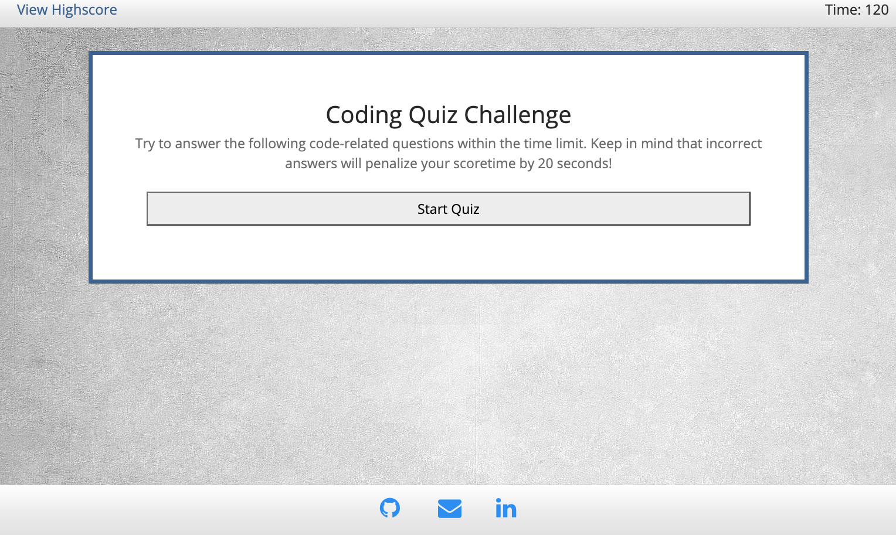

# Code-Quiz

This is a javaScript code quiz that tests the users knowledge of basic vanilla javaScript fundamentals. The quiz was designed from scratch using vanilla javaScript, html, and bootstrap CSS, as well as traditional CSS for additional design. I created this quiz by utilizing changes in display (set in easily accesible classes), creating and modifying elements in the DOM, and adding additonal javaScript and html pages. 

The code logic is based in on-click functionality with additional altering conditions. I used an array of objects to cycle through multiple question and answer buttons creating seamless page transitions in the DOM. I created score and time trackers, and allowed the user to enter there initials to be displayed on a seperate html Highscores page. The user's score, time, and initials were entered as objects which get pushed to local storage to keep track of previous scores for user comparison. These highscores are then pushed to the page and accessible even after retaking the quiz. 

[Deployed link](https://gary-bergman.github.io/Code-Quiz/)

[My github](https://github.com/Gary-Bergman)